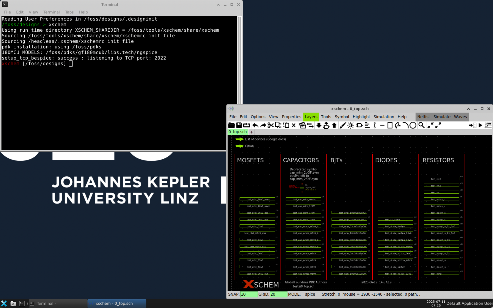
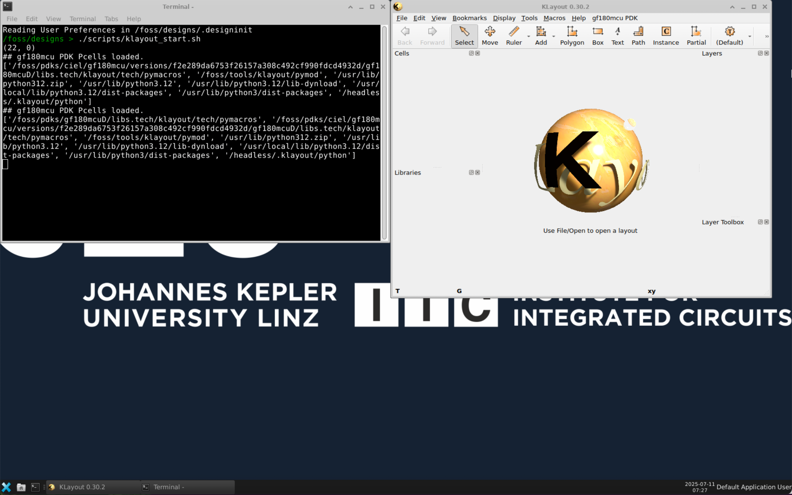

# 📋 Task Tracker
<!--
## To Do

- [ ] Task1
- [ ] Task1
- [ ] Task1

## In Progress

- [ ] Task1
- [ ] Task1

## Done

- [x] Task1
- [x] Task1
-->
| Task Name    | Date | Status | Ownership  | Comments |
|---------|-----|--------------|-------|--------|
| Schematic Level Simulations - NAND4_1  | 11/07/2025-21/07/2025  | Completed  | Arpit | Added the NAND4 spice file |
| Schematic Level Simulations - NAND3_1  | 11/07/2025-21/07/2025  | Completed  | Kowshik | Added the NAND3 spice file |
| Layout - NAND4_1  | 22/07/2025-04/08/2025  | Completed  | Arpit |Completed the NAND4 Layout|
| Layout - NAND3_1  | 22/07/2025-04/08/2025 | Completed  | Kowshik |Completed the NAND3 Layout|
| DRC and LVS - NAND4_1 | 04/08/2025-15/08/2025  | Work in Progress  | Arpit |DRC Cleaned|
| DRC and LVS - NAND3_1  | 04/08/2025-15/08/2025  | Work in Progress| Kowshik |DRC Cleaned|
| Characterization using Charlib - NAND4_1  | 15/08/2025-25/08/2025  | Work in Progress  | Arpit |Installed Charlib on the docker container|
| Characterization using Charlib - NAND3_1  | 15/08/2025-25/08/2025   | YWork in Progress  | Kowshik |-|
# IIC-OSIC-TOOLS Analog Design Project Template (GlobalFoundries 180nm)

This repository is an analog design project template for the SSCS 2025 Chipathon (https://github.com/sscs-ose/sscs-chipathon-2025). The design environment is setup using the IIC-OSIC-TOOLS docker container (https://github.com/iic-jku/IIC-OSIC-TOOLS). The container is preconfigured with GlobalFoundries 180nm PDK (gf180mcuD).

## What's Included

When you use this template, you get:
- **Pre-configured Docker environment** with IIC-OSIC-TOOLS and GlobalFoundries 180nm PDK
- **VNC and web-based GUI access** for design tools like Xschem, Ngspice, Magic, and KLayout
- **Cross-platform scripts** for launching the containerized design environment
- **Example analog schematic and layout design** (5-Transistor OTA) with proper library structure and testbench

## CAD Tool Computing Constellation
First, review [this document](https://github.com/mosbiuschip/chipathon2025/tree/main/CAD_tool_computing_constellation) to get a sense of how the various pieces of software work together on your computer. 

## Required Software on Your Computer

Before you begin, you'll need to install the following required software:

### 1. GitHub Desktop

- **Download**: [GitHub Desktop](https://desktop.github.com/)
- Available for Windows, macOS, and Linux
- Provides a user-friendly graphical interface for Git operations

You don't have to know how to use the `git` command. Although learning it helps you understand how the version control works. If you are an experienced user, feel free to manage your repository from the command-line interface (CLI).

### 2. Docker Desktop

`docker` is a lightweight, container-based alternative to virtual machines that ensures consistent development and deployment environments across different platforms by packaging applications with all their dependencies. *Docker Desktop* is its graphical user interface (GUI). 

**Download and Installation:**
- **Windows**: [Docker Desktop for Windows](https://docs.docker.com/desktop/install/windows-install/)
- **macOS**: [Docker Desktop for Mac](https://docs.docker.com/desktop/install/mac-install/)
- **Linux**: [Docker Desktop for Linux](https://docs.docker.com/desktop/install/linux-install/) or [Docker Engine](https://docs.docker.com/engine/install/)

**System Requirements:**
- **Windows**: Windows 10/11 with WSL 2 enabled  
  > **Note:** Windows Subsystem for Linux (WSL 2) provides the lightweight virtualization layer that Docker Desktop relies on for Linux containers. If WSL 2 is not yet installed on your machine, follow Microsoft’s official guide: <https://learn.microsoft.com/windows/wsl/install>. After WSL 2 is enabled, Docker Desktop will automatically detect it; see Docker’s documentation for details: <https://docs.docker.com/desktop/windows/wsl/>.
- **macOS**: macOS 10.15 or newer
- **Linux**: 64-bit distribution with kernel 3.10+

In this project we will be using the IIC-OSIC-TOOLS docker (https://github.com/iic-jku/IIC-OSIC-TOOLS) to setup our development environments.


## Getting Started: Team Environment Setup

### GitHub Collaborative Team Workflow
For the detailed branching and pull-request process see **[docs/team_workflow.md](docs/team_workflow.md)**.

In brief:
- The **team leader** creates the repository from this template and adds teammates as collaborators.
- Every contributor works on a dedicated feature branch and opens a pull request for review before merging into `main`.  

### Step 1: Create Your Project Repository

#### Use GitHub Template

This repository is set up as a GitHub template. Using the template feature gives you a clean project without the template's commit history.


1. Visit the template repository: [https://github.com/Jianxun/iic-osic-tools-project-template/](https://github.com/Jianxun/iic-osic-tools-project-template/)
2. Click the green **"Use this template"** button
3. Select **"Create a new repository"**
4. Fill in your repository details:
   - Repository name (e.g., `my-analog-design-project`)
   - Description (optional)
   - Choose public or private
5. Click **"Create repository"**


**Clone your new repository to your local machine using GitHub Desktop:**
1. Open GitHub Desktop
2. Click "Clone a repository from the Internet"
3. Select your newly created repository
4. Choose your local directory and click "Clone"


### Step 2: Launch the Docker Container

The project includes platform-specific scripts to launch the Docker container with the IIC-OSIC-TOOLS environment. **Before running the following scripts, make sure your Docker Desktop is running.**

#### For Mac/Unix/Linux Systems:
Open a terminal, navigate to you repository, and use the following command:
```bash
./start_chipathon_vnc.sh
```

#### For Windows Systems:

**Open Command Prompt or PowerShell** navigate to you repository, and use the following command:


```cmd
.\start_chipathon_vnc.bat
```
If you are familiar with git bash, feel free to use `start_chipathon_vnc.sh`.

#### ICC-OSIC-TOOLS Image Download 

Now the script pulls the IIC-OSIC-TOOLS *chipathon* image. Have a coffee.


### Step 3: Access the Design Environment in the Docker Container

Once the container is running, you have two options to access the design environment:

#### Option A: VNC Client (Recommended for better performance)
1. Download a VNC client:
   - **Windows**: [TigerVNC](https://tigervnc.org) 
   - **macOS**: [TigerVNC](https://tigervnc.org)  or built-in Screen Sharing
   - **Linux**: `vncviewer` (install via package manager)

2. Connect to: `localhost:5901`
3. Enter password: `abc123`


#### Option B: Web Browser (noVNC) (Good for quick debug)

1. Open your web browser
2. Navigate to: `http://localhost`
3. Enter password: `abc123`
4. Click "Connect"


### Step 4: Open a Terminal in the Container

Once you're in the VNC session, you can start running the design tools in the containter:
1. Right-click on the desktop
2. Select "Terminal Emulator" (or similar option)
3. You should automatically be in the `/foss/designs` directory


### Step 5: Launch Design Tools

You can now start the design tools from the terminal. 

#### Schematic Entry

Launch Xschem for schematic design:
```bash
xschem
```
You should see the Xschem GUI with available devices from `gf180mcu` and their testbenches. Xschem has UI buttons to netlist and simulate your schematic. You can display results in Xschem or GAW (an external viewer).

See the recommended schematic workflow **[docs/schematic_workflow.md](docs/schematic_workflow.md)**



#### Layout

Launch Klayout for layout design:
```bash
./scripts/klayout_start.sh
```
See the recommended layout workflow with Klayout **[docs/layout_workflow.md](docs/layout_workflow.md)**




#### Other Tools
You can launch the other design tools with their appropriate commands. Take a look at [this document](https://github.com/mosbiuschip/chipathon2025/tree/main/CAD_tool_flow) for a brief overview of the analog full custom design CAD flow. 


### [Troubleshooting Notes](troubleshooting.md)

## Running Tools After Installation

Once you have run the script for the first time, the container can be started much quicker. 

- Open a terminal or shell on your local machine, go to the local folder that holds your local repo and execute `./start_chipathon_vnc.sh` or `.\start_chipathon_vnc.bat`; [see Step 2 above](#step-2-launch-the-docker-container). Since the container exists, you will get the following prompt:

```
> ./start_chipathon_vnc.sh 
[WARNING] Container iic-osic-tools_chipathon_xvnc_uid_501 exists.
[HINT] It can also be restarted with "docker start iic-osic-tools_chipathon_xvnc_uid_501" or removed with "docker rm iic-osic-tools_chipathon_xvnc_uid_501" if required.

Press "s" to start, and "r" to remove: 
```
- Hit `s` to start the container. 
   - *Note:* You can also start the container from the *Docker Desktop* and directly connect with VNC (next step).

- Connect to the running container with VNC or your browser [see Step 3 above](#step-3-access-the-design-environment-in-the-docker-container).

- Start using the tools [Steps 4, 5, 6 above](#step-4-open-a-terminal-in-the-container)


## Library Structure Conventions

**A strict file management strategy is required to keep the project and file management easy for a successful tape-out.** Here we propose a folder structure that we think will work well, but of course, other organizations are possible. It's key  to communicate among team members and to *stick* to the chosen approach. 

### Project Folder Structure

The `/foss/designs` directory inside the Docker container is mounted from the `designs` folder in the local copy of this repository on your computer. 

**Important:** Keep all your design files in the `designs` folder to ensure they persist when the Docker container is restarted. Files in other folders inside the container might be deleted, and will for sure be lost if the container gets deleted. 

```
project-root/
├── designs/                 # Your design files (mounted in container as /foss/designs)
│   ├── libs/                   # Design libraries
│   ├── simulations/            # Symbolic link to the Xschem simulation result folder
│   └── scripts                 # scripts for launching tools and library maintenance
├── start_chipathon_vnc.sh   # Container launch script (Unix/Linux/Mac)
├── start_chipathon_vnc.bat  # Container launch script (Windows)
└── README.md                # This file
```

**FYI:** `/foss/designs/simulations` is a symbolic link to `/headless/.xschem/simulations` where `xschem` asks `ngspice` to save its simulation results. 

### Design Library Folder Structure

The project follows specific naming conventions for organizing design libraries under `/designs/libs/`:

```
/designs/libs/
├── core_*/          # Design libraries (core circuit cells)
├── tb_*/            # Testbench libraries
└── ...
```

### Naming Conventions
- **`core_*`**: Design libraries containing your core circuit implementations. 
- **`tb_*`**: Testbench libraries containing simulation and verification setups.

### File Organization
Within each library directory:
- Each cell should have its own subdirectory: `/designs/libs/library_name/cell_name/`
- Files within a cell directory should be prefixed with the cell name (e.g., `cell_name.sch`, `cell_name.sym`)
- **Exception**: Testbench directories (starting with `tb_`) are exempt from the file naming prefix requirement


## Example Design: 5-Transistor Single Stage OTA

This project includes a reference design to demonstrate the library structure and design flow:

### Libraries
- **Design**: 5-Transistor Single Stage Operational Transconductance Amplifier (OTA)
- **Library Location**: `core_analog`
- **Testbench Location**: `tb_analog`


### Usage
1. **Design Files**: Navigate to `/designs/libs/core_analog/` to find the schematics and symbols of the OTA cell and parameterized unit transistor cells.
2. **Testbench**: Use the verification setups in `/designs/libs/tb_analog/` to simulate and characterize the design.
3. **Validation**: Run the library check to ensure proper file organization:
   ```bash
   cd designs/CI
   ./library_check.sh
   ```

This example demonstrates the proper use of the library naming conventions (`core_*` for design libraries, `tb_*` for testbenches) and serves as a starting point for developing your own analog circuits.


## License

This project is licensed under the MIT License. See the [LICENSE](LICENSE) file for details.
